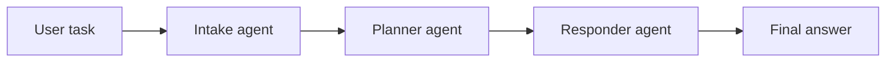
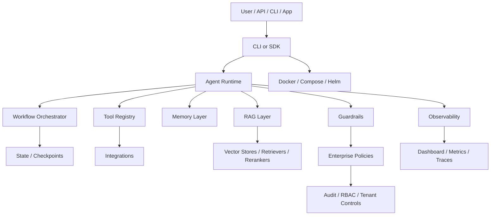

# Largestack AI

Largestack AI (`largestack`) is a Python 3.11+ framework for AI agents, RAG, guardrails, observability, workflow orchestration, and tool-based automation.

```bash
pip install largestack
```

Largestack is built for developers and teams moving from AI demos to production-style AI workflows. The largestack Python framework helps teams structure agents, retrieval, guardrails, traces, and orchestration without starting from a blank file.

[](https://pypi.org/project/largestack/)
[](https://pypi.org/project/largestack/)
[](https://pypi.org/project/largestack/)
[](https://github.com/Rivailabs/largestack/stargazers)

- Website: https://largestack.ai
- Docs: https://docs.largestack.ai
- PyPI: https://pypi.org/project/largestack/
- GitHub: https://github.com/Rivailabs/largestack

Largestack requires Python 3.11+.

**Largestack AI** is an open-source Python framework for building AI agents with guardrails, cost tracking, and traces built in — so you can put agents in front of real users without wiring the safety layer yourself.

It is designed for developers building support agents, RAG assistants, code reviewers, and workflow automations who want structure (typed agents, tools, retrieval, guardrails, observability) instead of a blank file.

> **Status: Beta (v1.1.0), maintained by a single developer.** Largestack installs and runs, ships a large test suite, and is a good fit for prototypes, internal experiments, and learning. It has **not** been independently audited, load-tested at scale, or certified for any regulated or enterprise use. The checks listed below are internal smoke/soak runs on the maintainer's own machines, not third-party validation — evaluate it for your own use case before relying on it.

See [`docs/known-limitations.md`](docs/known-limitations.md) for an honest, up-to-date list of what is and isn't proven.

## Install

```bash
pip install largestack
```

Verify:

```bash
largestack --help
python -c "import largestack; print(largestack.__version__)"
```

---

## Why Largestack?

Most agent frameworks solve only one layer: agents, chains, RAG, or observability. Largestack brings the main production surfaces together:

| Layer | What Largestack provides |
|---|---|
| Agents | `Agent`, typed agents, role-based agents, multi-agent teams |
| Tools | Safe tool calling, schemas, retries, timeout controls, approval policies |
| Workflows | Sequential, parallel, router, supervisor, graph/DAG-style orchestration |
| RAG | Loaders, chunking, retrievers, rerankers, vector stores, citations, no-answer behavior |
| Guardrails | PII checks, injection controls, topic/sensitive data policies, tool/provider policies |
| Memory | Buffer, long-term, vector-backed, shared and isolated memory patterns |
| Observability | Traces, cost tracking, event logs, dashboard APIs, OTEL helpers |
| Enterprise | RBAC, audit trail, tenant scoping, SSO/session modules, payment/billing scaffolds |
| Deployment | Docker, Compose, Helm charts, CI validation, release evidence |
| Testing | Unit, integration, security, RAG eval, live provider validation, generated project checks |

---

## Development quickstart

### 1. Open a source checkout

```bash
git clone https://github.com/Rivailabs/largestack.git
cd largestack
```

### 2. Create environment

```bash
python3.12 -m venv .venv
source .venv/bin/activate
python -m pip install -U pip setuptools wheel
```

### 3. Install editable development dependencies

For normal source development:

```bash
python -m pip install -e ".[dev]"
```

For CPU-only PyTorch dependency resolution on Linux/macOS:

```bash
PIP_EXTRA_INDEX_URL=https://download.pytorch.org/whl/cpu \
python -m pip install -e ".[dev]"
```

### 4. Run a first validation

```bash
python -m pytest tests/unit/test_memory.py -q --tb=short
```

### 5. Run the full suite

```bash
python -m pytest tests -q --tb=short -ra
```

---

## Minimal agent example

```python
import asyncio
from largestack import Agent

async def main():
    agent = Agent(
        name="assistant",
        llm="deepseek/deepseek-chat",
        instructions="Be concise and practical."
    )
    result = await agent.run("Explain Largestack in one sentence.")
    print(result.content)

asyncio.run(main())
```

For deterministic tests, use the built-in test/offline model patterns instead of a live cloud provider.

---

## Live provider setup

DeepSeek:

```bash
export LARGESTACK_DEEPSEEK_API_KEY="your_key_here"
python examples/01_hello/main.py
```

OpenAI:

```bash
export LARGESTACK_OPENAI_API_KEY="your_key_here"
export LARGESTACK_DEFAULT_MODEL="openai/gpt-4o-mini"
python examples/01_hello/main.py
```

Never commit `.env` or paste API keys into source files.

---

## LLM/API provider support

Largestack is provider-switchable. The core agent, workflow, RAG, guardrail,
and observability layers run through a model string such as
`openai/gpt-4o-mini`, `anthropic/claude-sonnet-4-6`,
`deepseek/deepseek-chat`, `litellm/groq/llama-3.1-70b-versatile`, or
`local/llama3.2`.

Largestack supports OpenAI/GPT, Anthropic/Claude, DeepSeek, LiteLLM,
Ollama/local models, and many OpenAI-compatible providers through the
capability matrix below. Support depth varies by provider — adapters marked
"Partial" have not all been through live end-to-end validation, so verify the
specific provider/model you depend on.

| Provider/API path | Model string example | Env/config | Status |
|---|---|---|---|
| OpenAI / GPT | `openai/gpt-4o-mini` | `LARGESTACK_OPENAI_API_KEY` | Verified primary adapter path |
| Anthropic / Claude | `anthropic/claude-sonnet-4-6` | `LARGESTACK_ANTHROPIC_API_KEY` | Adapter-only — native adapter implemented, **not** live-verified (run `check_connection` with your key) |
| DeepSeek | `deepseek/deepseek-chat` | `LARGESTACK_DEEPSEEK_API_KEY` | Live E2E validated |
| LiteLLM gateway | `litellm/<provider>/<model>` | Provider-specific LiteLLM env vars | Partial; downstream capability varies |
| Local OpenAI-compatible | `local/<model>` | `LARGESTACK_OPENAI_COMPATIBLE_BASE_URL` | Partial; gateway/model capability varies |
| Ollama native | `ollama/<model>` | `LARGESTACK_OLLAMA_BASE_URL` optional | Partial; chat path first |
| Azure OpenAI | `azure/<deployment>` | `LARGESTACK_AZURE_OPENAI_KEY`, `LARGESTACK_AZURE_OPENAI_ENDPOINT` | Partial; deployment-specific |
| Groq, Mistral, OpenRouter, xAI, Cerebras, SambaNova, NVIDIA | `<provider>/<model>` | `LARGESTACK_<PROVIDER>_API_KEY` | Partial/OpenAI-compatible; verify live |
| Google/Gemini, Cohere, Bedrock | `<provider>/<model>` | Provider env/credentials | Partial; feature support differs |

Inspect the runtime matrix:

```bash
python - <<'PY'
from largestack import provider_support_matrix
for row in provider_support_matrix():
    print(row["provider"], row["status"], "tools=", row["tool_calling"], "structured=", row["structured_output"])
PY
```

Run the provider-switchable flow demo offline:

```bash
python examples/provider_flow_demo/main.py
```

Run the same flow against GPT:

```bash
export LARGESTACK_OPENAI_API_KEY="your_key_here"
export LARGESTACK_DEFAULT_MODEL="openai/gpt-4o-mini"
export LARGESTACK_FLOW_DEMO_LIVE=1
python examples/provider_flow_demo/main.py
```

Run the same flow against Claude:

```bash
export LARGESTACK_ANTHROPIC_API_KEY="your_key_here"
export LARGESTACK_DEFAULT_MODEL="anthropic/claude-sonnet-4-6"
export LARGESTACK_FLOW_DEMO_LIVE=1
python examples/provider_flow_demo/main.py
```

Run the same flow against a local OpenAI-compatible endpoint:

```bash
export LARGESTACK_OPENAI_COMPATIBLE_BASE_URL="http://localhost:11434/v1"
export LARGESTACK_OPENAI_COMPATIBLE_API_KEY="ollama"
export LARGESTACK_DEFAULT_MODEL="local/llama3.2"
export LARGESTACK_FLOW_DEMO_LIVE=1
python examples/provider_flow_demo/main.py
```

---

## Flow demo

The quickest workflow demo is `examples/provider_flow_demo/main.py`. It runs
offline by default and can be switched to any configured provider by changing
only `LARGESTACK_DEFAULT_MODEL`.



What the demo proves:

- one task flows through three agents,
- DAG dependencies control execution order,
- each agent can use the same model string or provider family,
- offline `TestModel` validation requires no API key,
- live mode works with GPT, Claude, DeepSeek, LiteLLM, or local-compatible
  providers when credentials are configured.

---

## Built-in example areas

| Example | Purpose |
|---|---|
| `examples/00_offline_test_model.py` | Offline deterministic model check |
| `examples/01_hello` | Basic provider-backed agent |
| `examples/02_tools` | Tool calling |
| `examples/03_team` | Multi-agent/team behavior |
| `examples/04_guards` | Guardrails/security behavior |
| `examples/05_rag_knowledge` | RAG with knowledge files |
| `examples/06_streaming` | Streaming responses |
| `examples/07_structured` | Structured outputs |
| `examples/08_mcp_server` | MCP server pattern |
| `examples/10_full_app` | Integrated app pattern |
| `examples/provider_flow_demo` | Provider-switchable workflow demo |
| `examples/rag_basic` | Basic RAG assistant |
| `examples/fintech_kyc` | BFSI/KYC style workflow |
| `examples/riva_ai` | Riva/Largestack demo pipelines |

---

## Internal checks

These are checks the maintainer runs locally before publishing. They are **not**
independent audits, certifications, or production guarantees — read them as "the
author exercised this path on their own machine."

| Check | What it means |
|---|---|
| Unit + security test suite | 2,551 tests run in CI on Python 3.11–3.13; coverage gated ≥75% on the core wedge |
| Live DeepSeek e2e | Typed output, cost tracking, and tool calling run against the real DeepSeek API in CI (when the API-key secret is set; auto-skips otherwise) |
| Provider support matrix | Present, with explicit verified/partial adapter statuses |
| Offline provider flow demo | Runs deterministically with `TestModel`, no API key |
| Package build + `twine check` | Passes locally |
| Docker `/health` smoke | Container builds and the health endpoint responds |
| Local soak run | A repeated test loop ran for several hours without crashing — a stability smoke check, **not** a load or concurrency test |

For exactly what has and hasn't been proven, see [`docs/known-limitations.md`](docs/known-limitations.md).

---

## Architecture at a glance



---

## Repository map

| Path | Purpose |
|---|---|
| `largestack/_core` | Main agent/tool/runtime primitives |
| `largestack/_workflow` | Workflow graph, checkpoints, interrupts, subgraphs |
| `largestack/_rag` | RAG query engines, eval, summary index |
| `largestack/_memory` | Memory stores and memory tools |
| `largestack/_guard` | Provider/tool guardrail policies |
| `largestack/_security` | Sandbox, permissions, vault, encryption, network controls |
| `largestack/_enterprise` | RBAC, audit, tenant, SSO/session, billing/payment modules |
| `largestack/_observe` | Cost, traces, OTEL, telemetry helpers |
| `largestack/_dashboard` | Dashboard app and APIs |
| `largestack/_integrations` | Provider/tool integrations |
| `largestack/_templates` | Project starter templates |
| `examples/` | Runnable examples |
| `tests/` | Unit, integration, security, RAG eval tests |
| `scripts/` | Certification, smoke, scenario, and live DeepSeek validation scripts |
| `deploy/` | Docker, Compose, Helm, monitoring assets |
| `release_evidence/` | Internal smoke/soak logs from the maintainer's local runs |

---

## Production-positioning honesty

Largestack is strong for:

- developer demos,
- investor demos,
- internal AI platform experiments,
- controlled pilots,
- agentic framework portfolio proof,
- private beta deployments.

Largestack should not yet be marketed as:

- fully BFSI-certified,
- SOC2/ISO-certified,
- full LangChain/LangGraph ecosystem replacement,
- public SaaS production platform without load tests, external VAPT, and real Kubernetes install proof.

Known limitations are tracked in [`docs/known-limitations.md`](docs/known-limitations.md). Review that file before publishing release, SaaS, BFSI, or regulated-enterprise claims.

---

## Roadmap

| Priority | Work |
|---|---|
| P0 | Add load/concurrency evidence after completed 24h soak |
| P0 | Queue/backpressure for high traffic |
| P0 | Distributed workers and job leasing |
| P0 | Durable replay/checkpoint recovery |
| P1 | Real Kubernetes cluster install test |
| P1 | Observability UI polish and replay debugger |
| P1 | More beginner templates and tutorials |
| P2 | Public docs website |
| P2 | Community examples and plugin ecosystem |
| P3 | Enterprise certifications, VAPT, compliance evidence |

---

## Search and discovery

If you are looking for this project, search for:

- Largestack AI
- largestack Python framework
- RivaiLabs Largestack
- pip install largestack
- Largestack agents RAG guardrails observability

Official links:

- Website: https://largestack.ai
- PyPI: https://pypi.org/project/largestack/
- GitHub: https://github.com/Rivailabs/largestack
- Docs: https://docs.largestack.ai

---

## License

Apache-2.0.
