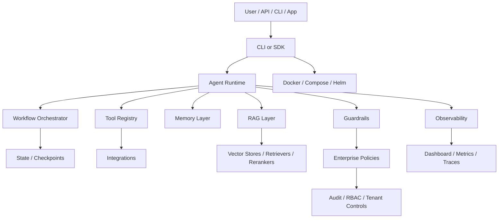

# Largestack AI

**Largestack AI** is an agentic AI framework for building practical AI applications with agents, tools, workflows, RAG, guardrails, observability, and deployment support in one project.

It is designed for developers who want to build real AI systems without starting from a blank file: support-ticket agents, RAG assistants, code reviewers, workflow automations, BFSI governance flows, and enterprise-style AI copilots.

> Current status: **v1.0 Release Candidate / controlled-pilot ready**. Ubuntu, Mac evidence, Windows clean validation, Docker, security, package, DeepSeek live validation, and 24-hour soak evidence have passed.

---

## Why Largestack?

Most agent frameworks solve only one layer: agents, chains, RAG, or observability. Largestack brings the main production surfaces together:

| Layer | What Largestack provides |
|---|---|
| Agents | `Agent`, typed agents, role-based agents, multi-agent teams |
| Tools | Safe tool calling, schemas, retries, timeout controls, approval policies |
| Workflows | Sequential, parallel, router, supervisor, graph/DAG-style orchestration |
| RAG | Loaders, chunking, retrievers, rerankers, vector stores, citations, no-answer behavior |
| Guardrails | PII checks, injection controls, topic/sensitive data policies, tool/provider policies |
| Memory | Buffer, long-term, vector-backed, shared and isolated memory patterns |
| Observability | Traces, cost tracking, event logs, dashboard APIs, OTEL helpers |
| Enterprise | RBAC, audit trail, tenant scoping, SSO/session modules, payment/billing scaffolds |
| Deployment | Docker, Compose, Helm charts, CI validation, release evidence |
| Testing | Unit, integration, security, RAG eval, live provider validation, generated project checks |

---

## 5-minute quickstart

### 1. Clone

```bash
git clone https://github.com/Rivailabs/largestack.git
cd largestack
```

### 2. Create environment

```bash
python3.12 -m venv .venv
source .venv/bin/activate
python -m pip install -U pip setuptools wheel
```

### 3. Install

For normal development:

```bash
python -m pip install -e ".[dev]"
```

For CPU-only PyTorch dependency resolution on Linux/macOS:

```bash
PIP_EXTRA_INDEX_URL=https://download.pytorch.org/whl/cpu \
python -m pip install -e ".[dev]"
```

### 4. Run a first validation

```bash
python -m pytest tests/unit/test_memory.py -q --tb=short
```

### 5. Run the full suite

```bash
python -m pytest tests -q --tb=short -ra
```

---

## Minimal agent example

```python
import asyncio
from largestack import Agent

async def main():
    agent = Agent(
        name="assistant",
        llm="deepseek/deepseek-chat",
        instructions="Be concise and practical."
    )
    result = await agent.run("Explain Largestack in one sentence.")
    print(result.content)

asyncio.run(main())
```

For deterministic tests, use the built-in test/offline model patterns instead of a live cloud provider.

---

## Live provider setup

DeepSeek:

```bash
export LARGESTACK_DEEPSEEK_API_KEY="your_key_here"
python examples/01_hello/main.py
```

OpenAI:

```bash
export LARGESTACK_OPENAI_API_KEY="your_key_here"
export LARGESTACK_DEFAULT_MODEL="openai/gpt-4o-mini"
python examples/01_hello/main.py
```

Never commit `.env` or paste API keys into source files.

---

## Built-in example areas

| Example | Purpose |
|---|---|
| `examples/00_offline_test_model.py` | Offline deterministic model check |
| `examples/01_hello` | Basic provider-backed agent |
| `examples/02_tools` | Tool calling |
| `examples/03_team` | Multi-agent/team behavior |
| `examples/04_guards` | Guardrails/security behavior |
| `examples/05_rag_knowledge` | RAG with knowledge files |
| `examples/06_streaming` | Streaming responses |
| `examples/07_structured` | Structured outputs |
| `examples/08_mcp_server` | MCP server pattern |
| `examples/10_full_app` | Integrated app pattern |
| `examples/rag_basic` | Basic RAG assistant |
| `examples/fintech_kyc` | BFSI/KYC style workflow |
| `examples/riva_ai` | Riva/Largestack demo pipelines |

---

## Validation status

Latest confirmed release-candidate evidence includes:

| Gate | Status |
|---|---|
| Ubuntu full pytest | Passed |
| Mac validation | Passed / evidence added |
| Windows validation | Passed / clean Windows validation confirmed |
| DeepSeek live difficult projects | 5/5 passed |
| Full DeepSeek integration suite | Passed with one known provider-format skip |
| Security suite | Passed |
| RAG eval suite | Passed |
| Package build + twine check | Passed |
| Docker runtime `/health` | Passed |
| Helm lint/template | Passed |
| 4-hour soak evidence | Passed |
| 24-hour soak | Passed / 210 successful cycles / 0 recorded failures |

---

## Architecture at a glance



---

## Repository map

| Path | Purpose |
|---|---|
| `largestack/_core` | Main agent/tool/runtime primitives |
| `largestack/_workflow` | Workflow graph, checkpoints, interrupts, subgraphs |
| `largestack/_rag` | RAG query engines, eval, summary index |
| `largestack/_memory` | Memory stores and memory tools |
| `largestack/_guard` | Provider/tool guardrail policies |
| `largestack/_security` | Sandbox, permissions, vault, encryption, network controls |
| `largestack/_enterprise` | RBAC, audit, tenant, SSO/session, billing/payment modules |
| `largestack/_observe` | Cost, traces, OTEL, telemetry helpers |
| `largestack/_dashboard` | Dashboard app and APIs |
| `largestack/_integrations` | Provider/tool integrations |
| `largestack/_templates` | Project starter templates |
| `examples/` | Runnable examples |
| `tests/` | Unit, integration, security, RAG eval tests |
| `scripts/` | Certification, smoke, scenario, and live DeepSeek validation scripts |
| `deploy/` | Docker, Compose, Helm, monitoring assets |
| `release_evidence/` | Validation evidence and release proof |

---

## Production-positioning honesty

Largestack is strong for:

- developer demos,
- investor demos,
- internal AI platform experiments,
- controlled pilots,
- agentic framework portfolio proof,
- private beta deployments.

Largestack should not yet be marketed as:

- fully BFSI-certified,
- SOC2/ISO-certified,
- full LangChain/LangGraph ecosystem replacement,
- public SaaS production platform without load tests, external VAPT, and real Kubernetes install proof.

Known limitations are tracked in [`docs/known-limitations.md`](docs/known-limitations.md). Review that file before publishing release, SaaS, BFSI, or regulated-enterprise claims.

---

## Roadmap

| Priority | Work |
|---|---|
| P0 | Add load/concurrency evidence after completed 24h soak |
| P0 | Queue/backpressure for high traffic |
| P0 | Distributed workers and job leasing |
| P0 | Durable replay/checkpoint recovery |
| P1 | Real Kubernetes cluster install test |
| P1 | Observability UI polish and replay debugger |
| P1 | More beginner templates and tutorials |
| P2 | Public docs website |
| P2 | Community examples and plugin ecosystem |
| P3 | Enterprise certifications, VAPT, compliance evidence |

---

## License

Apache-2.0.
