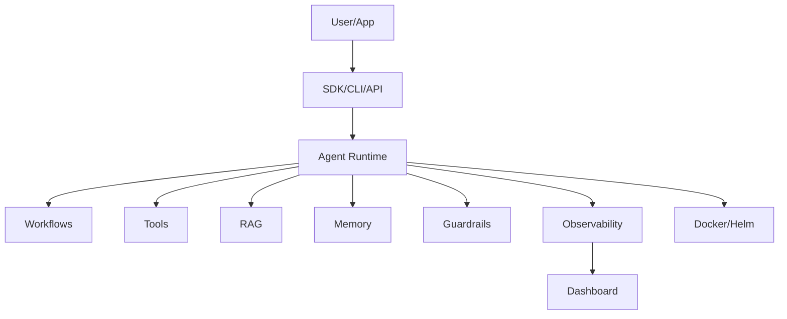

# Website Landing Page Copy

## Hero

**Largestack AI**

Build governed agentic AI applications with agents, tools, RAG, workflows, guardrails, observability, and deployment support in one framework.

**Status:** v1.0 Release Candidate — controlled-pilot ready.

Buttons:

- View GitHub
- Read Docs
- Run Quickstart

---

## Problem

Building production AI agents is not only about calling an LLM. Real applications need:

- tool safety,
- workflow control,
- document grounding,
- memory isolation,
- cost tracking,
- auditability,
- deployment proof,
- security validation.

Most teams stitch together many tools and still miss production controls.

---

## Solution

Largestack gives developers one integrated runtime for practical AI systems:

- agents,
- tools,
- workflows,
- RAG,
- guardrails,
- memory,
- observability,
- enterprise controls,
- Docker/Helm deployment,
- test/evidence gates.

---

## What you can build

- Support ticket agent
- RAG knowledge assistant
- Code reviewer
- Resume builder
- HR scorer
- BFSI maker-checker workflow
- AML monitoring assistant
- Procurement approval agent
- Compliance mapping assistant
- AI security gateway

---

## Validation

Largestack has been validated across:

- Ubuntu,
- macOS,
- Windows clean validation,
- Docker runtime,
- Helm lint/template,
- DeepSeek live tests,
- security scans,
- generated project scenarios,
- 4h soak evidence.

The 24h soak has completed with all recorded cycles passing. Load testing,
real Kubernetes install proof, and external security review remain the next
production hardening gates for public SaaS or regulated-enterprise claims.

---

## Architecture

---

## Positioning

Largestack is not a toy agent demo. It is a serious release-candidate framework for governed agentic AI systems.

It is currently best suited for:

- developer demos,
- investor demos,
- internal AI platform pilots,
- controlled enterprise experiments,
- portfolio and OSS credibility.
