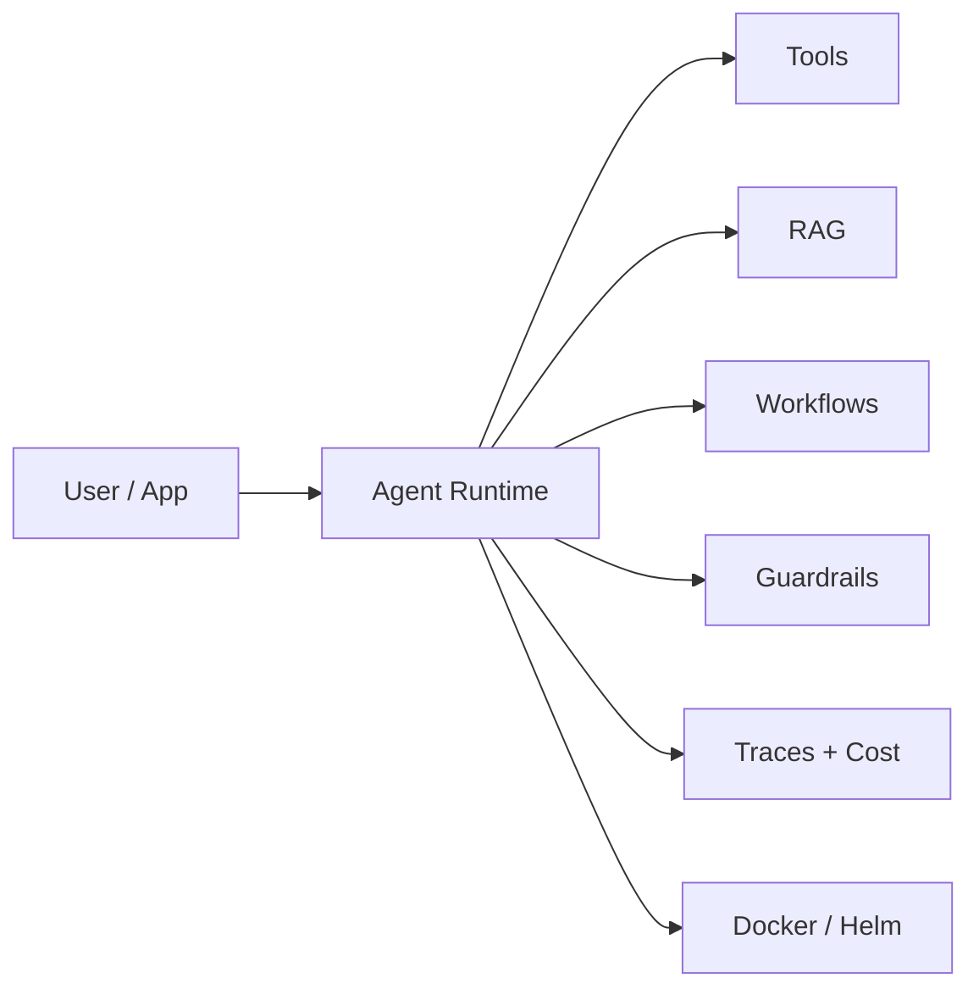
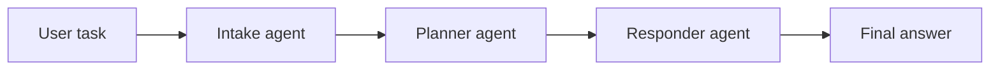
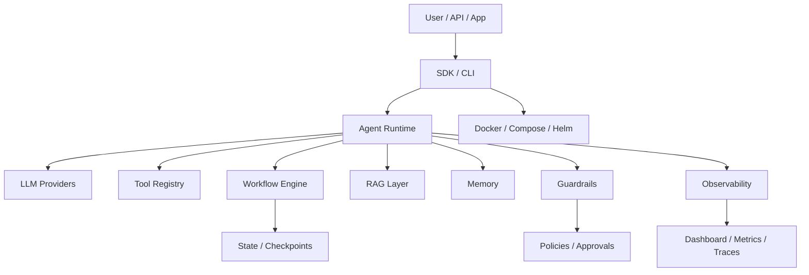
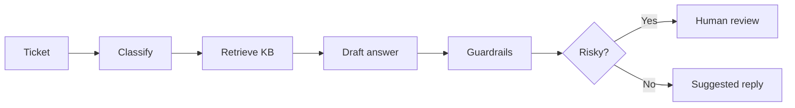

# Largestack AI Website Master Content Document

This is the single source document for the future Largestack AI website. It
combines project facts, release evidence, competitor positioning research, page
structure, homepage copy, product messaging, demo ideas, and honest readiness
guidance.

The goal is not to copy competitor websites. The goal is to learn what strong
agent-framework websites explain clearly, then present Largestack accurately:
as a governed, provider-switchable, validated agentic AI framework that is
ready for controlled pilots and strong developer/investor demos.

---

## 1. Executive Positioning

### One-line positioning

Largestack AI is an agentic AI framework for building governed AI applications
with agents, tools, workflows, RAG, memory, guardrails, observability, provider
switching, and deployment evidence in one project.

### Short positioning

Build practical AI agents that do more than chat. Largestack gives developers a
single runtime for agent orchestration, safe tool use, document grounding,
memory, workflow control, observability, and deployment foundations, with
recorded validation evidence across Linux, macOS, Windows, Docker, Helm,
security scans, live DeepSeek tests, generated project scenarios, and 24-hour
soak testing.

### Website headline options

1. Build governed agentic AI applications.
2. Agents, workflows, RAG, guardrails, and observability in one framework.
3. From AI prototype to controlled pilot with evidence.
4. The practical agent runtime for serious AI apps.
5. Build AI agents that can be tested, traced, governed, and deployed.

Recommended H1:

**Build governed agentic AI applications.**

Recommended subheadline:

Largestack AI helps developers build agentic applications with provider
switching, tools, workflows, RAG, memory, guardrails, observability, and
deployment-ready foundations without stitching ten frameworks together.

### Proof bar

Use this near the hero:

- v1.0 Release Candidate
- Controlled-pilot ready
- 2510+ test suite validation
- 24h soak: 210 successful cycles, 0 recorded failures
- DeepSeek live difficult-project validation: 5/5 passed
- Ubuntu, macOS, and Windows validation evidence
- Docker, Helm, package, security scan gates passed

### Honest public claim

Use this:

> Largestack is a controlled-pilot ready agentic AI framework with strong
> validation evidence, live provider proof, security gates, Docker/Helm
> foundations, and release artifacts.

Avoid this until external proof exists:

> Fully public SaaS production ready, BFSI-certified, SOC2-certified, or a
> complete replacement for every LangChain/LangGraph/LlamaIndex ecosystem use
> case.

---

## 2. What We Built

Largestack is not just a demo script. It is a framework and release-candidate
codebase with the following surfaces.

### Core runtime

- Agent runtime with instructions, model selection, retries, structured output,
  cost budgets, and execution results.
- Typed decorator API inspired by modern Python framework ergonomics.
- Tool registry with schemas, docstring descriptions, permissions, approvals,
  retries, timeouts, and idempotency patterns.
- Multi-agent/team patterns including supervisor-style coordination.
- Workflow engine with DAG, sequential, parallel, router/supervisor mental
  models, state machine behavior, subgraphs, checkpointing foundations, and
  interrupt patterns.
- RAG layer with loaders, chunking, vector stores, retrieval, reranking,
  citations, and no-answer behavior.
- Memory layer with short-term, long-term, vector-backed, shared, and isolated
  memory patterns.
- Guardrail layer for prompt injection, PII, topic policy, output checks, tool
  policy, provider policy, approval gates, and sensitive operations.
- Observability layer for traces, cost tracking, events, dashboard APIs,
  metrics, and OTEL-style integration foundations.
- Enterprise-oriented modules for RBAC, audit, tenant scoping, sessions/SSO
  foundations, billing/payment scaffolds, compliance scenarios, and policy
  controls.
- Deployment assets for local development, Docker, Compose, Helm, health
  checks, and release validation.
- Testing helpers with deterministic offline models so agent behavior can be
  tested without live API calls.

### Provider support

Largestack is provider-switchable. The main model string pattern is:

```text
provider/model
```

Examples:

```text
openai/gpt-4o-mini
anthropic/claude-sonnet-4-6
deepseek/deepseek-chat
litellm/groq/llama-3.1-70b-versatile
local/llama3.2
ollama/llama3
azure/<deployment>
openrouter/<model>
```

Recommended website wording:

> Largestack supports OpenAI/GPT, Anthropic/Claude, DeepSeek, LiteLLM,
> Ollama/local models, and many OpenAI-compatible providers through a
> verified/partial capability matrix.

Important honesty:

- OpenAI and DeepSeek are the strongest (live-verified) primary paths. The Anthropic
  adapter is implemented but not yet live-verified (adapter-only in the matrix).
- DeepSeek has live difficult-project validation evidence.
- LiteLLM opens access to many providers, but downstream capability depends on
  the provider and model.
- Local/OpenAI-compatible providers are useful for vLLM, LM Studio, Ollama
  `/v1`, and enterprise gateways, but tool-calling quality depends on the local
  runtime/model.
- Do not claim every provider has equal production-grade tool calling,
  structured output, streaming, and cost tracking until live E2E is run for that
  exact provider/model.

### Built-in examples and demos

High-signal demos to show on the website:

1. Support Ticket Agent
   - Classification, routing, RAG, draft response, escalation.
   - Easy for buyers and developers to understand.

2. RAG Assistant with Citations
   - Document grounding, retrieval, reranking, citations, no-answer behavior.
   - Shows why Largestack is more than prompt wrappers.

3. BFSI Maker-Checker / AML Demo
   - Approval gates, audit trail, PII/guardrails, compliance-style flow.
   - Shows governance and enterprise value.

4. Provider Flow Demo
   - Same workflow can run offline with `TestModel`, live with GPT, live with
     Claude, live with DeepSeek, or local with OpenAI-compatible providers.
   - Website should show this as a simple architecture flow.

5. 50 Generated Project Categories
   - Support ticket API, CRM, task manager, expense tracker, inventory tracker,
     appointment booking, lead capture, document extraction, mini RAG, workflow
     dashboard, AI security gateway, resume builder, HR scorer, code reviewer,
     ML automation, video/social pipeline, planner core, fintech KYC, legal
     RAG, DPDP breach workflow, BGV portal, trading risk, e-sign approval,
     engineering workflow, B2B sales forecast, RevOps pipeline cleaner,
     customer success health monitor, vendor risk assistant, procurement
     approval, invoice reconciliation, AR collections, compliance mapping,
     incident response, support copilot, field dispatch, QA planning, cloud
     cost optimizer, sales coaching, renewal risk, partner onboarding, supply
     chain delay, DSR/privacy automation, audit testing, RFP response, feedback
     intelligence, workforce planning, obligation tracking, MSP SLA routing,
     BFSI loan origination, BFSI AML transaction monitoring.

Website should not display all 50 in the homepage. Use a "Use Case Library"
page and show the best 9-12 use cases as cards.

---

## 3. How Good Is Largestack Now?

### Current maturity

Largestack is strong enough to present as a serious release-candidate framework
for controlled pilots, internal demos, investor demos, developer demos, and
portfolio/OSS credibility.

It should not yet be marketed as a fully audited public SaaS platform or
regulated enterprise-certified product.

### Maturity scores

| Category | Current score | Website message |
|---|---:|---|
| Framework engineering | 93/100 | Strong framework foundation |
| Validation rigor | 96/100 | Release evidence is unusually strong for an early framework |
| Ubuntu readiness | 97/100 | Strong local Linux path |
| macOS readiness | 90+/100 | Evidence captured |
| Windows readiness | 90/100 | Clean validation confirmed |
| Live provider proof | 95/100 | DeepSeek live proof is strong |
| Provider breadth | 88/100 | Broad matrix, exact features vary by provider |
| Docker/Helm baseline | 88/100 | Strong baseline, real cluster install still next |
| Enterprise direction | 88/100 | Good foundations, external audit still required |
| Public SaaS maturity | 82/100 | Needs load, queue, workers, VAPT, support ops |
| Regulated BFSI maturity | 78/100 | Good demos/foundations, certification not done |
| Overall current maturity | 91/100 | Controlled-pilot ready |

### What is genuinely impressive

- The framework has many real surfaces: agents, tools, workflows, RAG, memory,
  guardrails, observability, deployment, examples, and provider adapters.
- It has validation evidence instead of only marketing claims.
- The 24-hour soak evidence gives a trust signal that many early agent projects
  do not have.
- The DeepSeek live difficult-project test set shows live provider behavior
  beyond simple "hello world" demos.
- The project has practical enterprise themes: RBAC, audit, tenant scope,
  guardrails, PII, approval flows, cost tracking, and deployment.
- It supports deterministic tests via `TestModel` and `FunctionModel`, which is
  crucial because real LLM tests are expensive and unstable.
- The provider support matrix is honest and reduces overclaiming risk.

### What still needs hardening

Position this as a roadmap, not as a weakness:

- Load/concurrency evidence.
- Queue/backpressure for high traffic.
- Distributed worker/job leasing model.
- Durable checkpoint/replay hardening.
- Real Kubernetes cluster install proof.
- External VAPT/security review.
- Public docs website polish.
- Better observability UI and replay debugger.
- More templates and community examples.
- Formal compliance/certification evidence if targeting regulated buyers.

---

## 4. Competitor Research Summary

Competitor research shows a clear pattern: strong AI agent websites lead with
simple developer value, visual proof, model/provider choice, orchestration, RAG,
observability, deployment, and trust.

### LangGraph / LangChain

Competitor focus:

- Reliable/stateful agent orchestration.
- Streaming, memory, human-in-the-loop, and fine-grained control.
- LangSmith for debugging, evaluation, observability, and deployment.
- Strong ecosystem and customer proof.

What to learn:

- Use a visual workflow/graph as a first-screen proof point.
- Explain why explicit workflow control matters.
- Show trace/debug/eval visibility as production value, not extra tooling.

Largestack angle:

- Largestack should say it is an integrated governed runtime, not only a graph
  library.
- Largestack can compete on "framework plus validation evidence" and
  "governance built into the story."

Source: https://www.langchain.com/langgraph

### CrewAI

Competitor focus:

- Multi-agent systems for engineers.
- Simplicity plus power.
- Local development, tools, UI, community.
- "Use any models" message.

What to learn:

- Keep the homepage simple and human.
- Make multi-agent automation easy to understand.
- Community and docs should be visible in the top nav.

Largestack angle:

- Largestack should keep the simplicity message, but differentiate with
  stronger validation, guardrails, RAG, security, and deployment evidence.

Source: https://www.crewai.dev/

### LlamaIndex

Competitor focus:

- Data/context augmentation.
- RAG, connectors, document parsing, indexing, query engines, workflows, and
  agents over private data.
- Strong developer docs and quickstart.

What to learn:

- RAG needs its own page, not only a feature bullet.
- Explain the difference between models knowing public data and agents using
  private/company data.
- Show document-to-answer pipeline visually.

Largestack angle:

- Largestack should not try to beat LlamaIndex on every data connector.
- Instead, position RAG as one built-in layer inside a larger governed agent
  runtime with workflows, tools, guardrails, memory, and observability.

Source: https://developers.llamaindex.ai/python/framework/

### Microsoft Agent Framework

Competitor focus:

- Agents plus graph-based workflows.
- Type-safe routing, checkpointing, human-in-the-loop support, sessions,
  telemetry, middleware, MCP clients, and model/provider support.
- Enterprise credibility.

What to learn:

- Explain clearly when to use agents versus workflows.
- Type safety, checkpointing, session state, and telemetry are enterprise
  buying signals.
- Responsible AI disclaimers and testing responsibility should be explicit.

Largestack angle:

- Largestack can borrow the clarity of "agents for open-ended tasks, workflows
  for controlled steps."
- Largestack should frame governance, testing, and safety as core engineering
  responsibilities.

Source: https://learn.microsoft.com/en-us/agent-framework/overview/

### OpenAI Agents SDK

Competitor focus:

- Agents, tools, handoffs, guardrails, sessions, streaming, and tracing.
- First-party OpenAI model integration.
- Clean mental model for orchestration.

What to learn:

- Handoffs, traces, guardrails, and tools should be shown as a unified agent
  loop.
- Website examples should be short and runnable.

Largestack angle:

- Largestack should emphasize provider-switching and non-OpenAI options while
  still supporting GPT/OpenAI.
- Largestack can position itself as a framework that gives similar agent
  building blocks plus project scaffolds, RAG, enterprise controls, and release
  evidence.

Source: https://developers.openai.com/api/docs/guides/agents

### Pydantic AI

Competitor focus:

- Type-safe agent development.
- Model-agnostic providers.
- Pydantic validation, dependency injection, tools, structured output, evals,
  observability, MCP/A2A/UI streams, human approval, durable execution, graph
  support.

What to learn:

- Type safety and validation are strong developer trust signals.
- Show dependency injection and typed outputs early.
- Testing/evals should be visible as first-class, not hidden in docs.

Largestack angle:

- Largestack already has typed/decorator-style API and deterministic test
  models. The website should make this obvious.
- Position Largestack as practical and governed, with Pydantic-style developer
  ergonomics plus broader deployment and release evidence.

Source: https://pydantic.dev/docs/ai/overview/

### Dify

Competitor focus:

- Production-ready agentic workflows.
- Visual workflow builder.
- RAG pipelines, integrations, observability, global LLMs, tools, MCP, and
  publishing/deployment.

What to learn:

- Buyers understand visual workflow screenshots immediately.
- "Everything in one place" is a strong message if backed by proof.
- Marketplace, connectors, and publishing are important for future ecosystem
  perception.

Largestack angle:

- Largestack can say "code-first governed framework today; visual builder and
  polished observability UI on the roadmap."
- For now, use Mermaid diagrams and demo screenshots to show workflows.

Source: https://dify.ai/

---

## 5. Website Information Architecture

Recommended top navigation:

- Product
- Developers
- Docs
- Examples
- Validation
- Security
- Roadmap
- GitHub

Recommended pages:

1. Home
2. Product Overview
3. Agent Runtime
4. Workflows
5. RAG
6. Guardrails and Security
7. Observability
8. Provider Support
9. Deployment
10. Examples / Use Cases
11. Validation Evidence
12. Docs
13. Roadmap
14. About / Contact

Optional future pages:

- Compare: Largestack vs LangGraph
- Compare: Largestack vs CrewAI
- Compare: Largestack vs LlamaIndex
- Compare: Largestack vs Dify
- Enterprise Governance
- Local LLMs
- BFSI/Compliance Use Cases
- Templates Marketplace

---

## 6. Homepage Content

### Hero

H1:

**Build governed agentic AI applications.**

Subheadline:

Largestack AI is a provider-switchable framework for building agents, tools,
workflows, RAG assistants, guardrails, memory, observability, and deployment
foundations in one practical runtime.

Primary CTA:

**Start Quickstart**

Secondary CTA:

**View GitHub**

Tertiary CTA:

**See Validation Evidence**

Hero proof strip:

```text
v1.0 RC | Controlled-pilot ready | 24h soak passed | DeepSeek live validated | Docker + Helm baseline | Security scans passed
```

Recommended hero visual:

Use a clean architecture/workflow image or interactive diagram:



### Section: Why Largestack

Headline:

**Production AI agents need more than prompts.**

Body:

Real AI applications need controlled tool calls, document grounding, workflow
state, memory isolation, cost visibility, guardrails, audits, deployment, and
repeatable tests. Largestack brings those layers together so teams can build
practical AI systems without stitching together a fragile stack from scratch.

Feature bullets:

- Agent runtime with tool use and retries.
- Workflows for explicit multi-step control.
- RAG for grounded answers over private data.
- Guardrails for injection, PII, policy, and tool safety.
- Memory for session, vector, and shared context patterns.
- Observability for traces, costs, events, and dashboard APIs.
- Provider support for GPT, Claude, DeepSeek, LiteLLM, local models, and more.
- Docker/Helm deployment foundations and release evidence.

### Section: What You Can Build

Headline:

**From support copilots to governed enterprise workflows.**

Cards:

1. Support Ticket Agent
   - Classify tickets, search docs, draft answers, escalate risky cases.

2. RAG Knowledge Assistant
   - Answer with citations from documents, policies, manuals, and internal KBs.

3. Code Review Agent
   - Analyze code, suggest fixes, run deterministic validation paths.

4. BFSI Maker-Checker Flow
   - Approval-gated financial workflow with audit and PII controls.

5. Procurement Approval Agent
   - Route requests, check policy, detect missing evidence, recommend action.

6. Incident Response Agent
   - Classify severity, suggest containment, generate audit-ready response.

### Section: Provider Switching

Headline:

**Use GPT, Claude, DeepSeek, local models, or an OpenAI-compatible gateway.**

Body:

Largestack uses explicit model strings so teams can switch provider paths
without rewriting the application architecture.

Code:

```python
from largestack import Agent

agent = Agent(
    name="assistant",
    llm="openai/gpt-4o-mini",
    instructions="Be concise and practical.",
)
```

Model examples:

```text
openai/gpt-4o-mini
anthropic/claude-sonnet-4-6
deepseek/deepseek-chat
litellm/<provider>/<model>
local/llama3.2
ollama/llama3
openrouter/<model>
```

CTA:

**View Provider Matrix**

### Section: Flow Demo

Headline:

**A real workflow in one screen.**

Body:

The provider flow demo runs offline by default with `TestModel`, then can run
live with GPT, Claude, DeepSeek, LiteLLM, or local OpenAI-compatible models by
changing `LARGESTACK_DEFAULT_MODEL`.

Diagram:



Command:

```bash
python examples/provider_flow_demo/main.py
```

Live GPT:

```bash
export LARGESTACK_OPENAI_API_KEY="your_key_here"
export LARGESTACK_DEFAULT_MODEL="openai/gpt-4o-mini"
export LARGESTACK_FLOW_DEMO_LIVE=1
python examples/provider_flow_demo/main.py
```

Live Claude:

```bash
export LARGESTACK_ANTHROPIC_API_KEY="your_key_here"
export LARGESTACK_DEFAULT_MODEL="anthropic/claude-sonnet-4-6"
export LARGESTACK_FLOW_DEMO_LIVE=1
python examples/provider_flow_demo/main.py
```

### Section: Architecture

Headline:

**One runtime for the layers agents need in production.**

Architecture:



### Section: Validation Evidence

Headline:

**Built with evidence, not only claims.**

Table:

| Gate | Evidence |
|---|---|
| Full pytest | Passed in release-candidate validation |
| 24h soak | 210 cycles, 46 tests per cycle, 9660 recorded passes, 0 recorded failures |
| DeepSeek live difficult projects | 5/5 passed |
| Ubuntu validation | Passed |
| macOS validation | Passed / evidence captured |
| Windows validation | Clean validation confirmed |
| Security scans | Bandit, pip-audit, gitleaks release gates passed |
| Package | Build and twine checks passed |
| Docker | Image/runtime health baseline passed |
| Helm | Lint/template passed |
| Generated project scenarios | 50 project categories validated as mini-product slices |

CTA:

**Read Release Status**

### Section: Security and Governance

Headline:

**Guardrails, policies, and auditability are part of the framework.**

Body:

Largestack is designed for controlled AI execution. It includes patterns for
prompt injection checks, PII controls, tool permissions, approvals, provider
policies, tenant scoping, audit trails, cost budgets, and release security
gates.

Bullets:

- Input, tool, and output guardrail stages.
- PII and sensitive-content controls.
- Tool permission and approval policies.
- Provider policy and routing controls.
- Audit, RBAC, session, and tenant foundations.
- Secret scan and security test guidance.

### Section: Roadmap

Headline:

**Next: scale, polish, and enterprise proof.**

Roadmap cards:

- Queue and backpressure.
- Distributed workers and job leasing.
- Durable checkpoint replay.
- Load/concurrency evidence.
- Real Kubernetes install proof.
- Observability UI polish and replay debugger.
- External VAPT and compliance evidence.
- Templates, marketplace, and community examples.

### Final CTA

Headline:

**Start building governed AI agents.**

Body:

Clone Largestack, run the quickstart, inspect the examples, and start with a
tested workflow instead of an empty file.

Buttons:

- Start Quickstart
- Read Docs
- View GitHub

---

## 7. Product Pages

### Product Overview Page

Purpose:

Explain Largestack as a full agentic AI application framework.

Sections:

- What Largestack is.
- Who it is for.
- Why integrated layers matter.
- Architecture diagram.
- Feature matrix.
- Validation proof.
- Getting started CTA.

Key copy:

Largestack is for developers and teams who want to build practical agentic AI
applications with governance from the beginning: agents that use tools, search
private data, follow workflows, respect policies, expose traces, and can be
tested without live model calls.

### Agent Runtime Page

Sections:

- Agent creation.
- Model/provider selection.
- Tool registration.
- Retries and cost budgets.
- Structured output.
- Testing with `TestModel`.
- Example code.

Code:

```python
from largestack import Agent

agent = Agent(
    name="support-agent",
    llm="deepseek/deepseek-chat",
    instructions="Classify support tickets and suggest the next action.",
    cost_budget=0.10,
    retries=1,
)
```

### Workflows Page

Sections:

- Agents for open-ended tasks.
- Workflows for controlled processes.
- DAG flow.
- State machine flow.
- Supervisor/router patterns.
- Checkpoints and replay roadmap.

Hero line:

Use workflows when the process has steps that must be controlled, audited, or
replayed.

### RAG Page

Sections:

- Why models need private context.
- Loaders/chunking/embedding/vector stores.
- Retrieval/reranking/citations.
- No-answer behavior.
- Tenant/project filtering patterns.
- Example RAG assistant.

Hero line:

Ground agent answers in your documents, policies, manuals, and knowledge bases.

### Guardrails and Security Page

Sections:

- Input checks.
- Tool checks.
- Output checks.
- PII and injection.
- Provider policies.
- Secret safety.
- Security validation commands.
- Honest compliance status.

Hero line:

Govern agent behavior before, during, and after model execution.

### Observability Page

Sections:

- Traces.
- Costs.
- Events.
- Tool calls.
- RAG events.
- Guardrail decisions.
- Dashboard APIs.
- Replay debugger roadmap.

Hero line:

See what your agent did, what it cost, and where it failed.

### Provider Support Page

Sections:

- Model string pattern.
- Verified/partial/experimental/adapter-only status definitions.
- Matrix table.
- DeepSeek live evidence.
- OpenAI/Claude examples.
- Local model examples.
- Warning about feature variance.

Hero line:

Choose the model/provider path that fits your cost, latency, privacy, and
deployment needs.

### Deployment Page

Sections:

- Local development.
- Docker.
- Compose.
- Helm.
- Dashboard health.
- Environment variables and secrets.
- Production readiness ladder.
- Real K8s proof roadmap.

Hero line:

Move from local agent development to containerized controlled pilots.

### Validation Evidence Page

Sections:

- Release status.
- Test suite.
- Security scans.
- Live provider tests.
- DeepSeek difficult project set.
- 24h soak evidence.
- Docker/Helm/package gates.
- What remains before public SaaS/regulatory claims.

Hero line:

Largestack is validated like software, not only demoed like a prompt.

---

## 8. Use Case Pages

Recommended first use-case pages:

### Support Ticket Agent

Problem:

Support teams need classification, answer drafting, knowledge retrieval, and
risk escalation without leaking customer data or sending unsafe tool calls.

Largestack flow:



Key features:

- RAG over support docs.
- PII redaction.
- Tool approval for write/send actions.
- Trace and cost tracking.
- Escalation route.

### RAG Knowledge Assistant

Problem:

Teams need AI answers grounded in their documents, not guesses.

Key features:

- Loaders and chunking.
- Retrieval and reranking.
- Citations.
- No-answer behavior.
- Tenant filtering.
- Evaluation tests.

### BFSI Maker-Checker Workflow

Problem:

Financial workflows require policy checks, approval gates, audit logs, and
PII-safe handling.

Key features:

- Maker-checker control.
- PII guardrails.
- Approval before risky action.
- Audit event record.
- Human escalation.
- No disbursement without approval.

### Code Review Agent

Problem:

Teams want AI help with code review and repair but need deterministic tests and
safe execution.

Key features:

- Review agent.
- Repair loop.
- TestModel/FunctionModel validation.
- Compile/test gates.
- Traceable output.

---

## 9. Competitive Positioning

### Simple positioning map

| Competitor | Strongest website message | Largestack response |
|---|---|---|
| LangGraph | Reliable stateful agent workflows and LangSmith visibility | Largestack offers workflows plus RAG, guardrails, deployment, and release evidence in one project |
| CrewAI | Simple multi-agent automation for engineers | Largestack keeps multi-agent patterns but adds stronger governance, testing, RAG, and evidence |
| LlamaIndex | Data/RAG framework for agents over private data | Largestack includes RAG as one layer inside a broader governed agent runtime |
| Microsoft Agent Framework | Enterprise agents, workflows, sessions, telemetry, type-safe orchestration | Largestack should adopt similar clarity while staying Python/open framework oriented |
| OpenAI Agents SDK | First-party agents, tools, handoffs, guardrails, tracing | Largestack adds provider switching and broader project/deployment scaffolding |
| Pydantic AI | Type-safe Python agent framework with validation/evals | Largestack should highlight typed API, deterministic testing, and release evidence |
| Dify | Visual production-ready agentic workflows, RAG, integrations, observability | Largestack is code-first today; visual workflow and observability UI polish are roadmap items |

### Largestack differentiation

Use these messages:

- Built for governed agentic applications, not just prompt chains.
- Agent runtime plus workflow control plus RAG plus guardrails.
- Provider-switchable: GPT, Claude, DeepSeek, LiteLLM, local, and compatible APIs.
- Deterministic agent testing without API calls.
- Release evidence included: tests, security scans, Docker, Helm, live provider,
  generated projects, and soak.
- Enterprise direction built in: RBAC, audit, tenant scoping, policies, approvals,
  and compliance scenarios.
- Honest capability matrix instead of blanket overclaims.

Avoid these messages:

- "Better than LangChain/LangGraph in every way."
- "Fully production ready for all enterprises."
- "Certified for BFSI."
- "All providers fully support all features."
- "No-code visual builder" unless/until the UI is actually built.

---

## 10. Website Content Blocks Ready To Reuse

### Feature grid

| Feature | Copy |
|---|---|
| Agents | Define AI workers with instructions, tools, provider choice, retries, and cost budgets. |
| Tools | Register typed functions, schemas, permissions, approvals, timeouts, and safe side-effect patterns. |
| Workflows | Control multi-step execution with DAGs, routers, supervisors, state machines, and subgraphs. |
| RAG | Ground answers in documents using loaders, chunking, retrieval, reranking, citations, and no-answer behavior. |
| Memory | Add buffer, long-term, vector, shared, and isolated memory patterns. |
| Guardrails | Check inputs, tool calls, provider policy, PII, injection, and outputs. |
| Observability | Trace model calls, tool calls, RAG events, guardrail decisions, cost, and runtime health. |
| Providers | Use GPT, Claude, DeepSeek, LiteLLM, Ollama/local models, and OpenAI-compatible APIs. |
| Deployment | Validate with local runs, package builds, Docker, Compose, Helm, and release evidence. |
| Testing | Use deterministic offline models, unit tests, security tests, RAG evals, and live provider gates. |

### Short product paragraph

Largestack AI is a code-first framework for building real agentic AI systems:
support copilots, RAG assistants, compliance workflows, code reviewers,
automation agents, and enterprise-style AI copilots. It combines the runtime
pieces teams need to move beyond prototypes: provider switching, tool schemas,
workflows, guardrails, memory, observability, deployment foundations, and
repeatable validation.

### Developer trust paragraph

Agents are hard to trust if they cannot be tested. Largestack includes
deterministic testing helpers, provider capability status, release validation
commands, security checks, and evidence folders so teams can separate working
software from demo luck.

### Enterprise trust paragraph

Largestack is designed around controlled AI execution: policies before tool
calls, PII and injection checks, approval gates, audit records, tenant and
session foundations, cost budgets, and deployment controls. It is ready for
controlled pilots today, with load, K8s, VAPT, and compliance proof as the next
enterprise hardening gates.

### Quickstart block

```bash
git clone https://github.com/Rivailabs/largestack.git
cd largestack
python3.12 -m venv .venv
source .venv/bin/activate
python -m pip install -U pip setuptools wheel
python -m pip install -e ".[dev]"
python -m pytest tests/unit/test_memory.py -q --tb=short
python examples/provider_flow_demo/main.py
```

### Provider demo block

```bash
export LARGESTACK_OPENAI_API_KEY="your_key_here"
export LARGESTACK_DEFAULT_MODEL="openai/gpt-4o-mini"
export LARGESTACK_FLOW_DEMO_LIVE=1
python examples/provider_flow_demo/main.py
```

```bash
export LARGESTACK_ANTHROPIC_API_KEY="your_key_here"
export LARGESTACK_DEFAULT_MODEL="anthropic/claude-sonnet-4-6"
export LARGESTACK_FLOW_DEMO_LIVE=1
python examples/provider_flow_demo/main.py
```

```bash
export LARGESTACK_DEEPSEEK_API_KEY="your_key_here"
export LARGESTACK_DEFAULT_MODEL="deepseek/deepseek-chat"
export LARGESTACK_FLOW_DEMO_LIVE=1
python examples/provider_flow_demo/main.py
```

### Validation block

```bash
python -m pytest tests -q --tb=short -ra
python -m build
python -m twine check dist/*
bandit -r largestack -x tests --severity-level medium
pip-audit --skip-editable
gitleaks detect --source . --no-git
docker build -t largestack:local-check .
helm lint deploy/helm/largestack
```

---

## 11. Website Design Direction

### Visual tone

Use a serious, developer-first, trust-focused design. Avoid making it look like
a generic AI landing page.

Recommended feel:

- Clean technical dashboard.
- High-contrast code and architecture sections.
- Evidence/proof badges.
- Workflow diagrams.
- Product screenshots when available.
- Calm enterprise palette with enough contrast, not a one-color gradient page.

### First viewport

Must show:

- Largestack AI name.
- Clear H1.
- One-sentence value.
- Proof bar.
- CTA buttons.
- Real architecture/workflow visual.

### Suggested visuals

- Hero: agent workflow diagram.
- Product section: architecture diagram.
- Provider section: model matrix table.
- Validation section: release evidence cards.
- Use case section: support-ticket workflow screenshot/diagram.
- Security section: input/tool/output guardrail pipeline.
- Deployment section: local -> Docker -> Helm ladder.

### Avoid

- Pure abstract AI art with no product signal.
- Overclaiming "enterprise ready" without scope.
- Huge generic hero with no code or architecture.
- Too much competitor comparison on homepage.
- Long wall of all 50 project categories on the first page.

---

## 12. FAQ

### Is Largestack only for DeepSeek?

No. DeepSeek is the live provider path with strong current validation evidence.
Largestack also supports GPT/OpenAI, Claude/Anthropic, LiteLLM, local models,
Ollama, and many OpenAI-compatible providers through a capability matrix.

### Can I use GPT or Claude?

Yes. Use `openai/...` for GPT/OpenAI models and `anthropic/...` for
Claude/Anthropic models, with the matching environment variables.

### Is every provider fully verified?

No. The website should be explicit: some providers are verified, some are
partial, some are experimental, and some are adapter-only. Feature support
varies by provider and model.

### Is Largestack production ready?

Largestack is controlled-pilot ready. It has strong release-candidate evidence,
but public SaaS or regulated enterprise claims should wait for load testing,
real Kubernetes install proof, external VAPT, and compliance review.

### Does Largestack replace LangChain or LlamaIndex?

No need to say that. Largestack is a governed agentic AI framework with an
integrated runtime and validation evidence. It overlaps with parts of
LangGraph, CrewAI, LlamaIndex, Pydantic AI, and Dify, but the better message is
that Largestack brings agent runtime, workflows, RAG, guardrails, observability,
providers, deployment, and testing together in one practical framework.

### Is there a visual builder?

Not yet as the main product claim. Largestack has dashboard and observability
foundations, but the polished visual workflow UI should be presented as roadmap
unless built and validated.

### What is the best demo?

Start with the provider flow demo, then show support-ticket RAG and BFSI
maker-checker/AML. These three demos explain provider switching, practical
business value, and governance.

---

## 13. Content Checklist For Website Build

Before building the actual website, prepare:

- Logo/wordmark.
- Hero architecture graphic.
- Three demo screenshots or Mermaid diagrams.
- Provider matrix table.
- Validation evidence cards.
- Quickstart snippet.
- Flow demo snippet.
- Use case cards.
- Security/governance diagram.
- Roadmap cards.
- GitHub link.
- Docs link.
- Release evidence link.
- Known limitations link.
- Contact/community link.

---

## 14. Source Links Used For Competitor Research

These links informed the content strategy and competitor positioning summary:

- LangGraph / LangChain: https://www.langchain.com/langgraph
- CrewAI: https://www.crewai.dev/
- LlamaIndex Framework docs: https://developers.llamaindex.ai/python/framework/
- Microsoft Agent Framework overview: https://learn.microsoft.com/en-us/agent-framework/overview/
- OpenAI Agents SDK docs: https://developers.openai.com/api/docs/guides/agents
- Pydantic AI overview: https://pydantic.dev/docs/ai/overview/
- Dify: https://dify.ai/

---

## 15. Final Website Narrative

Largestack should be presented as a serious, practical, governed agentic AI
framework.

The strongest story is:

1. Developers need more than LLM calls.
2. Largestack brings the production layers together.
3. You can build agents, workflows, RAG, tools, memory, guardrails, and
   observability in one project.
4. You can run GPT, Claude, DeepSeek, LiteLLM, local models, and compatible
   providers.
5. You can test offline with deterministic models.
6. You can deploy with Docker/Helm foundations.
7. You can trust the release candidate because evidence exists.
8. You can start with controlled pilots now.
9. You can follow a clear roadmap toward public SaaS and enterprise production.

Recommended final tagline:

**Build agentic AI with control, context, and evidence.**
