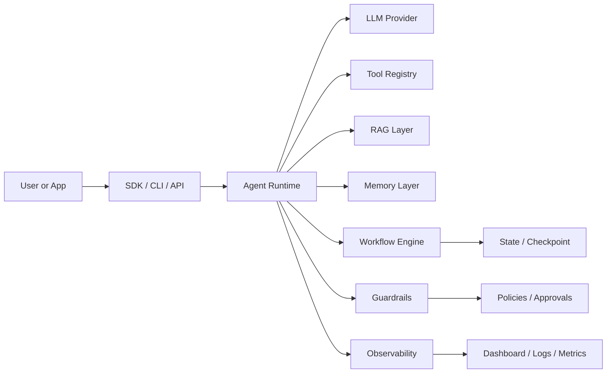
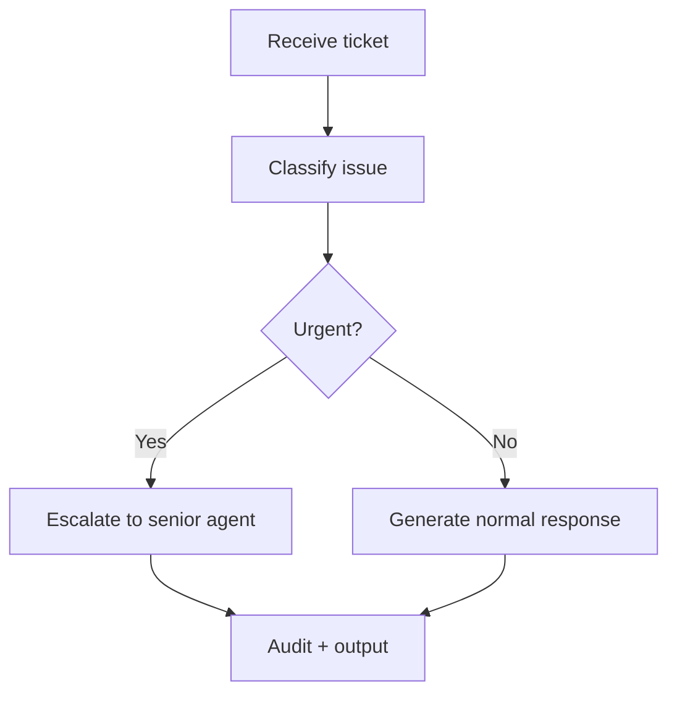
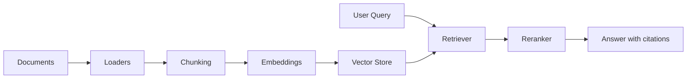
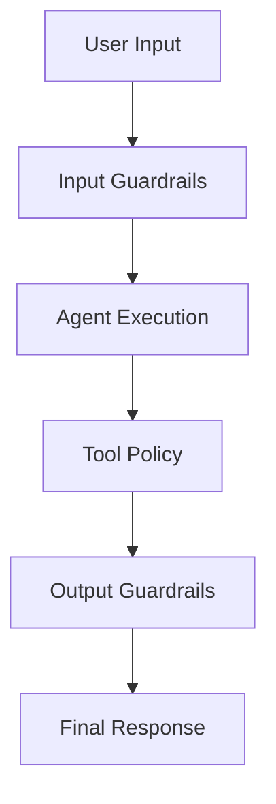
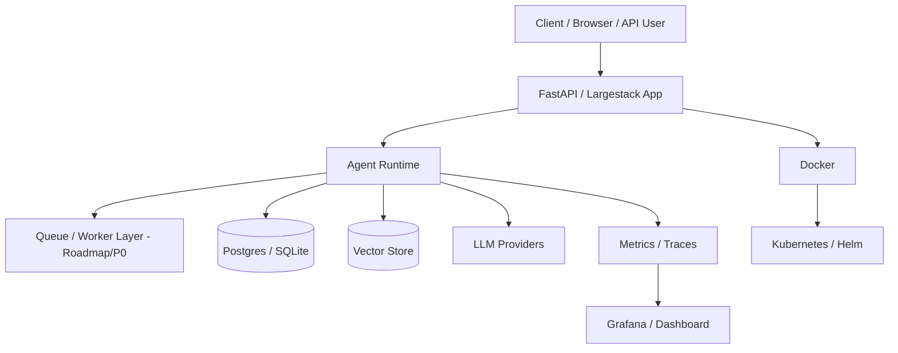

# Largestack Architecture

This document explains how Largestack works internally in beginner-friendly but technically accurate terms.

---

## 1. Simple mental model

Largestack is a runtime for AI applications.

A normal application has:

```text
User -> API -> Business Logic -> Database -> Response
```

A Largestack application has:

```text
User -> Agent -> Tools/RAG/Memory/Workflow/Guardrails -> Observability -> Response
```

The agent is not just a chatbot. It is a controlled runtime component that can:

- reason over a task,
- call approved tools,
- use memory,
- retrieve documents,
- follow workflow steps,
- obey guardrails,
- produce auditable outputs.

---

## 2. Main runtime blocks



---

## 3. Agent runtime

The agent runtime is the core execution layer. It handles:

- model selection,
- instructions,
- user input,
- tool schemas,
- retries,
- structured output,
- execution result handling.

Typical usage:

```python
from largestack import Agent

agent = Agent(
    name="support-agent",
    llm="deepseek/deepseek-chat",
    instructions="Classify support tickets and suggest the next action."
)
```

---

## 4. Tool layer

Tools let the agent interact with code and systems.

Examples:

- calculator,
- file reader,
- HTTP client,
- database query,
- browser/search adapter,
- custom Python function,
- approval-protected write action.

A production tool should define:

| Control | Why it matters |
|---|---|
| Input schema | Prevents malformed calls |
| Timeout | Prevents stuck executions |
| Retry policy | Handles transient errors |
| Permission level | Blocks unsafe actions |
| Idempotency | Avoids duplicate side effects |
| Audit log | Tracks who/what called it |

---

## 5. Workflow orchestration

Workflows control how tasks move from step to step.

Supported concepts include:

- sequential steps,
- parallel execution,
- router decisions,
- supervisor patterns,
- graph workflows,
- checkpoint and interrupt patterns,
- subgraphs.

Example workflow mental model:



---

## 6. RAG layer

RAG means retrieval-augmented generation. Instead of asking the model to guess, Largestack retrieves relevant documents and grounds the answer.

RAG pipeline:



Important behaviors:

- cite sources when available,
- refuse/no-answer when evidence is insufficient,
- filter by tenant/project when needed,
- support table/document retrieval patterns.

---

## 7. Memory layer

Memory stores previous context or facts. Largestack has memory patterns for:

- short-term buffer memory,
- long-term memory,
- vector memory,
- shared memory,
- isolated tenant/session memory.

Memory must be controlled carefully. Enterprise systems should avoid leaking memory between users, tenants, or projects.

---

## 8. Guardrails and security

Guardrails are policy checks around the agent.

They help prevent:

- prompt injection,
- unsafe tool calls,
- PII exposure,
- hallucinated answers,
- policy violations,
- unapproved write actions.

Guardrails should be applied before, during, and after agent execution.



---

## 9. Observability

Observability lets developers understand what happened.

Largestack tracks:

- execution traces,
- cost data,
- model calls,
- tool calls,
- RAG events,
- guardrail decisions,
- dashboard health.

Production systems need this because AI failures are often not simple exceptions. They are usually wrong route, wrong retrieval, wrong tool, wrong policy, or wrong model behavior.

---

## 10. Enterprise layer

Largestack includes enterprise-oriented modules for:

- RBAC,
- audit,
- tenant scoping,
- SSO/session foundations,
- billing/payment scaffolds,
- canary controls,
- compliance scenarios.

These are strong framework foundations, but external audit, VAPT, and enterprise certification are still separate requirements before regulated production claims.

---

## 11. Deployment architecture



Current deployment support includes Docker, Compose, Helm templates, dashboard health endpoints, and validation scripts. Real cluster install evidence should be captured before enterprise deployment claims.
